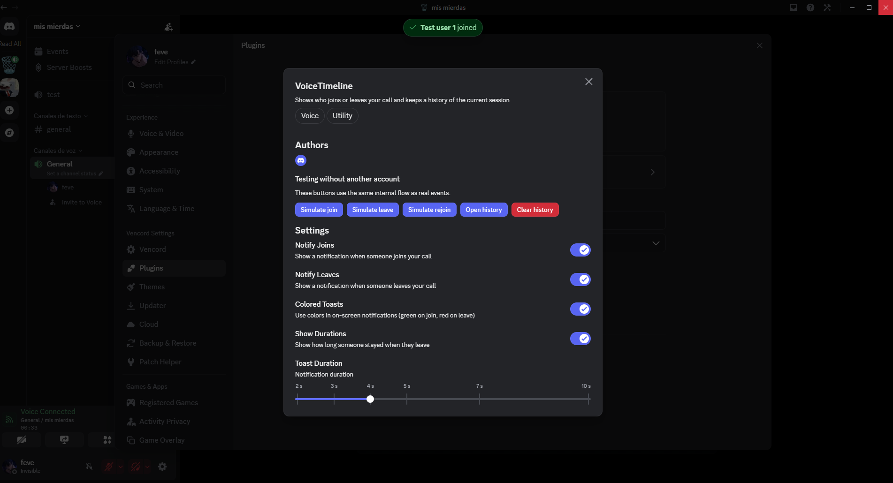
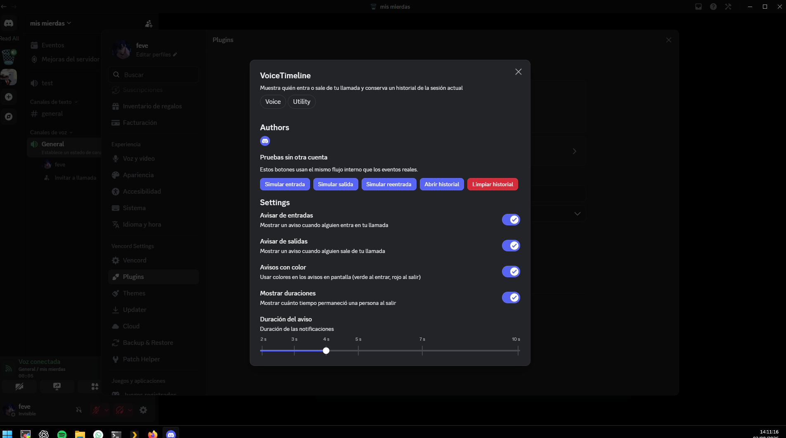

# VoiceTimeline

[](https://github.com/fevegit/VoiceTimeline/releases)
[](LICENSE)
[](https://vencord.dev/)

A Vencord userplugin that shows who joins, leaves or rejoins your current Discord voice call and keeps a timeline for the active session.

VoiceTimeline keeps Discord's native toast design and makes the username bold for faster identification.

## Features

- Native Discord notifications for joins, leaves and rejoins.
- Bold username inside the original Discord toast.
- Optional green/red notification colors.
- Optional call duration when someone leaves.
- Configurable notification duration.
- Timeline for the current voice session.
- Voice-channel context-menu shortcut to open the history.
- Built-in simulation buttons for testing without a second account.
- Complete dynamic Spanish and English interface.
- No voice recording, telemetry or external services.

## Screenshots

### English



<details>
<summary>Spanish interface</summary>



</details>

## Installation

VoiceTimeline is a custom userplugin and requires a source build of Vencord.

### Windows — PowerShell

```powershell
Set-Location "$env:USERPROFILE\Vencord\src\userplugins"
git clone https://github.com/fevegit/VoiceTimeline.git voiceTimeline
Set-Location ..\..
pnpm build
pnpm inject
```

### Linux / macOS

```bash
cd ~/Vencord/src/userplugins
git clone https://github.com/fevegit/VoiceTimeline.git voiceTimeline
cd ../..
pnpm build
pnpm inject
```

Restart Discord, then enable **VoiceTimeline** under **Settings → Vencord → Plugins**.

### Updating

```bash
git -C src/userplugins/voiceTimeline pull
pnpm build
```

Reinject Vencord only when required by your installation.

## How it works

VoiceTimeline listens to Discord voice-state events for the call you are currently connected to. It stores only the active session timeline in memory and displays notifications through Discord's native toast system.

To make only the username bold while preserving Discord's exact toast appearance, the plugin observes the newly rendered native toast and replaces only its message text node with a bold username plus normal-weight action text.

## Privacy

- No audio is captured or recorded.
- No data is transmitted anywhere.
- No analytics or telemetry are included.
- The timeline is limited to the current client session.

## Compatibility

Discord frequently changes internal client modules. VoiceTimeline is maintained against current Vencord source builds, but Discord updates may require adjustments.

This plugin is not an official Vencord plugin and is provided on a best-effort basis.

## Español

VoiceTimeline muestra quién entra, sale o vuelve a entrar en tu llamada de voz actual y conserva un historial de la sesión activa.

### Funciones

- Avisos nativos de Discord para entradas, salidas y reentradas.
- Nombre del usuario en negrita dentro del toast original.
- Colores verde y rojo opcionales.
- Duración de permanencia opcional al salir.
- Duración configurable de las notificaciones.
- Historial de la sesión de voz actual.
- Acceso desde el menú contextual del canal de voz.
- Botones de simulación para probarlo sin otra cuenta.
- Interfaz completamente bilingüe español/inglés.
- Sin grabación de voz, telemetría ni servicios externos.

### Instalación rápida en Windows

```powershell
Set-Location "$env:USERPROFILE\Vencord\src\userplugins"
git clone https://github.com/fevegit/VoiceTimeline.git voiceTimeline
Set-Location ..\..
pnpm build
pnpm inject
```

Reinicia Discord y activa **VoiceTimeline** en **Ajustes → Vencord → Plugins**.

## Author

Created by [feve](https://github.com/fevegit).

## License

VoiceTimeline is licensed under the [GNU General Public License v3.0 or later](LICENSE).
